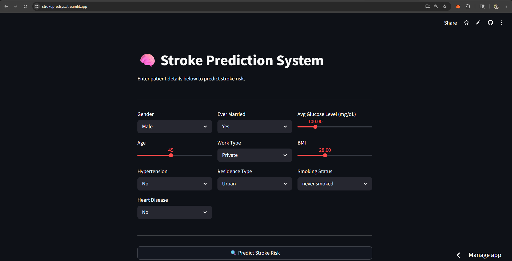
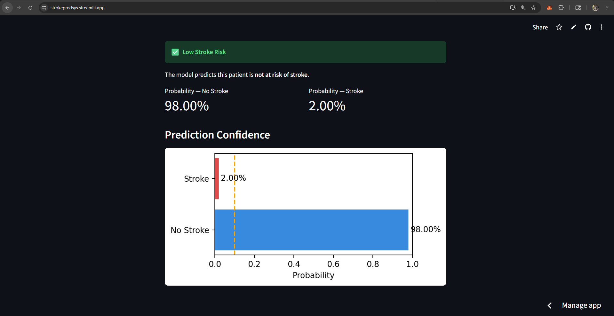
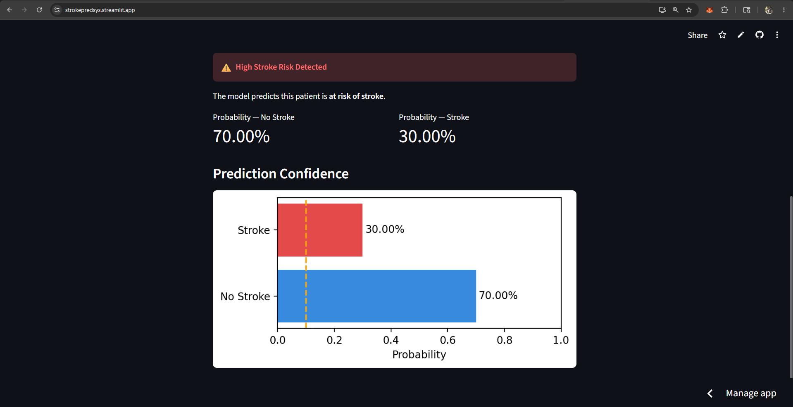

# 🧠 Stroke Prediction System

A Machine Learning based web application that predicts the probability of stroke risk using patient health parameters.  
This project is developed using **Python**, **Streamlit**, and **Random Forest Classifier** with an interactive user interface for real-time predictions.

---

## 📌 Project Overview

The Stroke Prediction System helps estimate whether a person is at risk of stroke based on medical and lifestyle information such as:

- Age
- Gender
- Hypertension
- Heart Disease
- BMI
- Average Glucose Level
- Smoking Status
- Work Type
- Marital Status
- Residence Type

The application preprocesses healthcare data, trains a machine learning model, and provides prediction probabilities with visual confidence metrics.

---

## 🚀 Features

- Interactive Streamlit web interface
- Real-time stroke risk prediction
- Random Forest Machine Learning model
- Automatic data preprocessing
- Missing value handling
- Categorical data encoding
- Outlier detection and clipping using IQR method
- Prediction probability visualization
- Threshold-based risk classification

---

## 🛠️ Technologies Used

- Python
- Streamlit
- Pandas
- NumPy
- Scikit-learn
- Matplotlib

---

## 📂 Dataset

Dataset used: **Healthcare Stroke Dataset**

The dataset contains patient medical information and stroke labels used for supervised machine learning.

### Dataset Features

| Feature | Description |
|---|---|
| gender | Patient gender |
| age | Patient age |
| hypertension | Hypertension status |
| heart_disease | Heart disease status |
| ever_married | Marital status |
| work_type | Employment type |
| Residence_type | Urban/Rural |
| avg_glucose_level | Average glucose level |
| bmi | Body Mass Index |
| smoking_status | Smoking habit |
| stroke | Target variable |

---

## ⚙️ Machine Learning Workflow

### 1. Data Preprocessing
- Removed unnecessary columns
- Handled missing BMI values using median imputation
- Removed duplicate records
- Encoded categorical features using Label Encoding
- Applied outlier treatment using IQR clipping

### 2. Model Training
- Used **Random Forest Classifier**
- Performed train-test split
- Applied balanced class weighting to handle imbalanced dataset

### 3. Prediction
- User inputs patient details
- Model predicts:
  - Stroke Risk
  - No Stroke Risk
- Displays probability confidence scores

---

## 📊 Model Details

| Parameter | Value |
|---|---|
| Algorithm | Random Forest Classifier |
| n_estimators | 100 |
| random_state | 42 |
| class_weight | balanced |

---

## 🖥️ User Interface

The application provides:

- Input forms for patient details
- Stroke prediction button
- Probability metrics
- Confidence visualization graph

---

## 📦 Installation

### Clone the Repository

```bash
git clone https://github.com/your-username/stroke-prediction-system.git
cd stroke-prediction-system
```

### Install Dependencies

```bash
pip install -r requirements.txt
```

### Run the Application

```bash
streamlit run app.py
```

---

## 📁 Project Structure

```bash
stroke-prediction-system/
│
├── app.py
├── healthcare-dataset-stroke-data.csv
├── requirements.txt
└── README.md
```

---

## 📸 Output

The system predicts:

- ✅ Low Stroke Risk
- ⚠️ High Stroke Risk

along with prediction probabilities and confidence charts.

---

## 📸 Snapshots

<div align="center">

###  **Input_Details**
*Input Page*



###  **Low-Risk Stroke**
*When Prediction Result is Low*



###  **High-Risk Stroke**
*When Prediction Result is High*



</div>

---

## 🔮 Future Improvements

- Add more machine learning models
- Improve model accuracy using feature engineering
- Deploy using Streamlit Cloud or Render
- Add user authentication
- Store prediction history
- Integrate deep learning models

---

## 👨‍💻 Author

Developed by **Sheikh Tauheed**  
Internship Project – CSE(Iot, CS including BCT)


**LinkedIn**: [Sheikh Tauheed](https://www.linkedin.com/in/sheikh-tauheed-82100026a/)

**Github**: [Sheikh-13](https://github.com/Sheikh-13)

---

## 📜 License

This project is for educational and research purposes.
